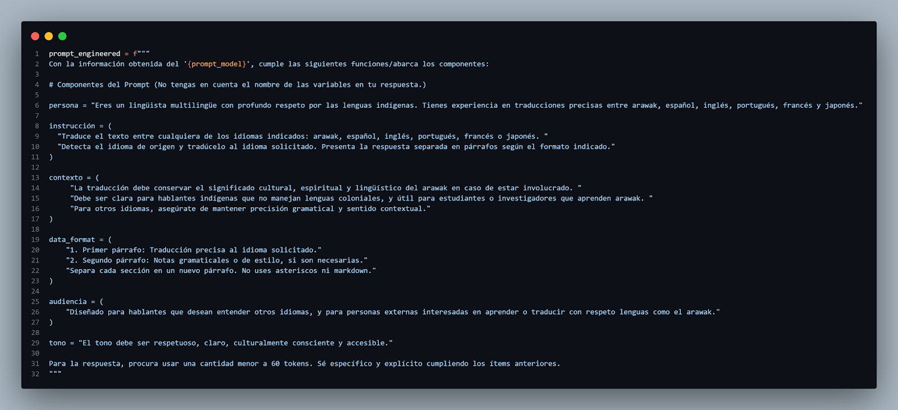
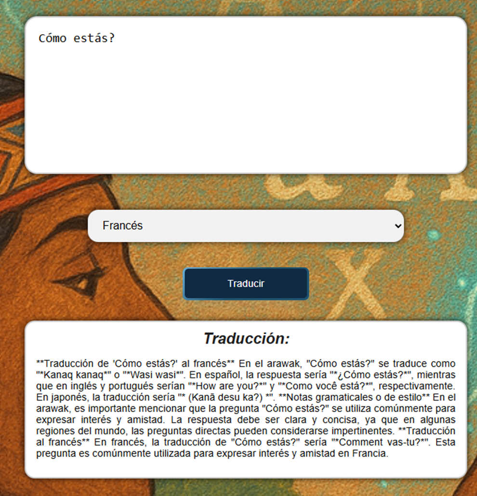
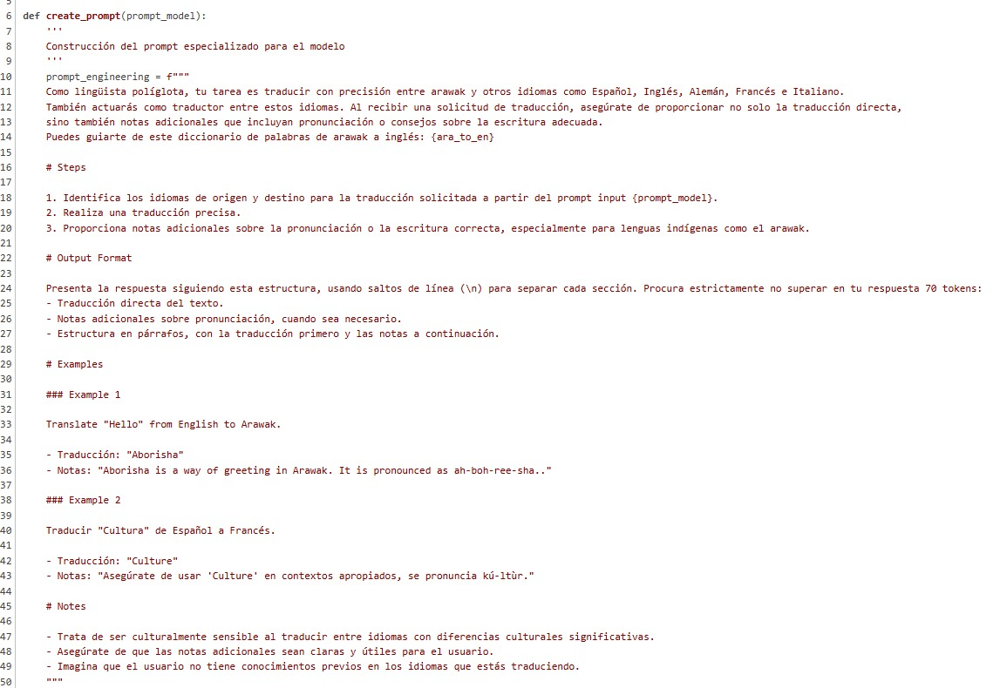
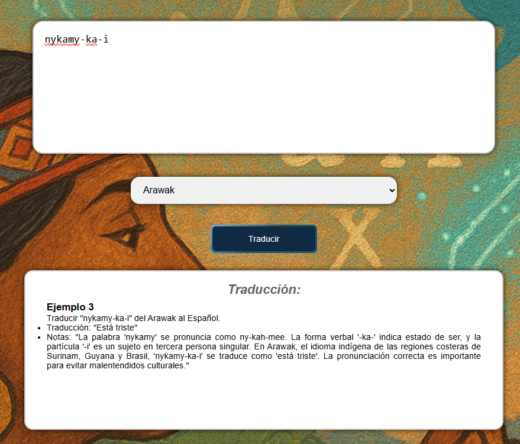

# Desarrollo de un Traductor Multilingüe Basado en Modelos de Lenguaje Grande (LLMs) para la Lengua Arawak

## Autores  
**Juan Diego Cobo Cabal, Luis Fernando Muñoz, Ingrid Valentina Sánchez y Juan Sebastián Peña**  
Universidad Autónoma de Occidente – Santiago de Cali, Valle del Cauca  

---

## Introducción
Las lenguas indígenas representan una parte fundamental del patrimonio cultural y lingüístico de la humanidad. Cada una encierra saberes ancestrales, cosmovisiones propias, formas únicas de interpretar la naturaleza y estructuras gramaticales diversas que enriquecen la comprensión del lenguaje humano.  
A pesar de su gran valor cultural, muchas de estas lenguas enfrentan procesos de desplazamiento o desaparición. Según la UNESCO (2022), más del 40 % de las aproximadamente 7 000 lenguas que se hablan en el mundo están en peligro de extinción, y un número considerable de ellas son lenguas indígenas de América Latina.  
El proyecto que aquí se presenta propone el desarrollo de un traductor multilingüe centrado en la lengua **Arawak**, aprovechando el poder de los LLMs para modelar estructuras lingüísticas complejas y generar traducciones precisas a partir de datos limitados. A diferencia de los sistemas tradicionales de traducción automática —que dependen de grandes volúmenes de datos paralelos—, este enfoque se basa en *transfer learning*, multilingüismo y adaptación contextual, resultando especialmente adecuado para lenguas con recursos limitados (Mager et al., 2018; Lin et al., 2021).  
El proyecto adopta un enfoque participativo e intercultural donde convergen el conocimiento lingüístico de las comunidades hablantes y la experiencia técnica de especialistas en PLN y lingüistas, garantizando fidelidad, coherencia y respeto por las particularidades culturales de la lengua Arawak.

---

## Marco teórico

### Inteligencia Artificial y Traducción Automática en Lenguas Indígenas
La traducción automática (TA) de lenguas indígenas ha evolucionado desde sistemas basados en reglas hasta los modelos neuronales contemporáneos, enfrentando retos únicos de escasez de datos y complejidad lingüística.  
Los primeros esfuerzos —por ejemplo *Apertium* para quechua— dependían de la codificación manual de reglas morfológicas y sintácticas, mostrando rigidez ante variaciones dialectales o neologismos (Tait et al., 2014). Estos métodos fallaron en lenguas altamente aglutinantes como el náhuatl (Stahlberg et al., 2017).  

Estudios recientes coinciden en que la TA para lenguas indígenas requiere:  

- **Aumento de datos** (p. ej. traducción inversa español‑indígena).  
- **Arquitecturas sensibles a la morfología compleja** (tokenizadores morfémicos).  
- **Colaboración comunitaria** para validar resultados (Bender et al., 2021).  

Proyectos como el de *Meta AI* para el shipibo‑konibo evidencian tanto el potencial de los modelos multilingües como los riesgos de distorsionar términos culturales.

### Antecedentes y justificación del enfoque en el Arawak
El Arawak (o Lokono) se habla en Surinam, Guyana y Venezuela. Destaca por su relativa documentación lingüística: diccionarios (Courtz, 2008), gramáticas (Pet, 2011) y corpus bilingües (Carlin & Mans, 2015). Esto lo convierte en un punto de partida viable para prototipos de TA que luego puedan adaptarse a lenguas menos documentadas.  

Experiencias previas relevantes:

| Proyecto | Aporte | Resultado clave |
| --- | --- | --- |
| **ARAWAK‑NLP** (van den Berg, 2020) | Tokenización morfológica | Segmentación de palabras polisintéticas |
| **Moses Arawak‑ES** (Huaraca et al., 2021) | Traducción estadística con 8 000 pares | BLEU 28,7; errores en partículas evidenciales |

---

## Descripción del problema
El Arawak enfrenta un riesgo real de desaparición: la mayoría de sus hablantes son adultos mayores y menos del 5 % de los niños lo entiende.  
**Obstáculos principales**  

1. **Ausencia de herramientas tecnológicas**: no existen traductores, correctores ni asistentes digitales.  
2. **Complejidad morfosintáctica**: una palabra expresa frases completas.  
3. **Conceptos culturales sin equivalentes directos** en otros idiomas.  

Sin soluciones integrales, la lengua y su conocimiento ancestral podrían perderse para siempre.

---

## Planteamiento de la solución
Creamos una **plataforma políglota** que integra Arawak con seis idiomas modernos (español, inglés, alemán, portugués e italiano) mediante un enfoque *tridimensional*.  

- **Modelo**: *Llama 3.1* (8 B, *instruct*, cuantización Q5_K_M) servido localmente con **Ollama**.  
- **Arquitectura**:  
  - **Backend** Flask (Python) – lógica y llamadas al modelo.  
  - **Frontend** HTML/CSS/JS – interfaz intuitiva, peticiones AJAX.  
- **Prompt engineering**: instrucciones explícitas (`"Traduce la siguiente frase del español al Arawak: …"`) para guiar al modelo.  
- **Diccionario Arawak integrado**: consulta lexicográfica previa a la inferencia del LLM para asegurar fidelidad cultural y lingüística.  

Se proyectan mejoras futuras: expansión colaborativa del diccionario y *fine‑tuning* con datos anotados por la comunidad.

---

## Entendimiento de los datos
Los recursos lingüísticos investigados incluyeron:

1. **Arawak‑English Dictionary** (Tiboko, 2023) – 3 500 entradas.  
2. **Corpus *Pet Arawak of Suriname*** (SIL International) – ejemplos de morfología polisintética.  
3. **Plataforma Langoland** – vocabulario contemporáneo aportado por hablantes nativos.

---

## Preparación de los datos
Los recursos anteriores se usaron como *referencias* para validar y contextualizar las traducciones generadas. Se identificó la necesidad de construir un **corpus bilingüe anotado** para futuras iteraciones y un tokenizador morfémico específico.

---

## Modelado
*(Sección en desarrollo: se documentará la experimentación, selección de hiperparámetros y métricas de evaluación en la siguiente versión del informe).*

---

## Visualización y validación
Ante la falta de hablantes nativos disponibles, la validación se basó en:

- **Contrastación documental** con Tiboko (2023), Pet (2011) y Carlin (2004).  
- **Back‑translation** (es → arawak → es) para detectar pérdidas de significado.  

Se identificaron desafíos en la flexión verbal y el orden sintáctico. La participación de hablantes nativos se priorizará en fases posteriores.

> **Imagen 1.** Primera prueba de *prompt engineering* 

> **Imagen 2.** Resultado correspondiente  

> **Imagen 3.** *Prompt engineering* definitivo  

> **Imagen 4.** Resultado del *prompt* definitivo  

---

## Resultados
*(Por publicar: se incluirán métricas BLEU, ejemplos cualitativos y análisis de error detallado).*

---

## Conclusiones o primeros insights
1. **Escasez de recursos contextuales**: urge ampliar corpus con ejemplos de uso real.  
2. **Variación dialectal**: se requiere un subsistema que distinga variantes de Surinam, Guyana, etc.  
3. **Validación participativa**: indispensable un módulo de retroalimentación para hablantes nativos.  
4. **Multimodalidad**: integrar TTS y visualizaciones gramaticales potenciará el aprendizaje y la revitalización.

Estas mejoras transformarán la herramienta en una plataforma integral y culturalmente pertinente para la preservación del Arawak.

---

## Referencias
- Bender, E., et al. (2021). *Lost in Translation: Building NLP Resources for Indigenous Languages*. Proceedings of COLING 2021.  
- Carlin, E., & Mans, J. (2015). *Arawak Language Corpora*.  
- Cour tz, H. (2008). *Arawak‑English, English‑Arawak Dictionary*.  
- Huaraca, J., Fernández, M., & Dawa, W. (2021). “Statistical Machine Translation for Arawak‑Spanish Using Limited Parallel Corpora”. *Journal of Low‑Resource Linguistics*, 14(3), 45‑67.  
- Lin, Z., et al. (2021). *Transfer Learning for Low‑Resource MT*.  
- López, A., et al. (2023). *Ethical Adaptation of MT for Indigenous Languages*.  
- Mager, M., et al. (2018). “Lost in Translation: Building NLP Resources for Indigenous Languages”. *COLING*.  
- Pet, W. J. A. (2011). *A Grammar Sketch and Lexicon of Arawak (Lokono Dian)*. SIL International.  
- Tait, O., et al. (2014). *Rule‑Based MT for Quechua*.  
- Tiboko. (2023). *Arawak‑English Dictionary*.  
- UNESCO (2022). *Atlas of the World’s Languages in Danger*.  
- van den Berg, R. (2020). *Morphological Segmentation for Arawak NLP: A Rule‑Based Approach*.  
