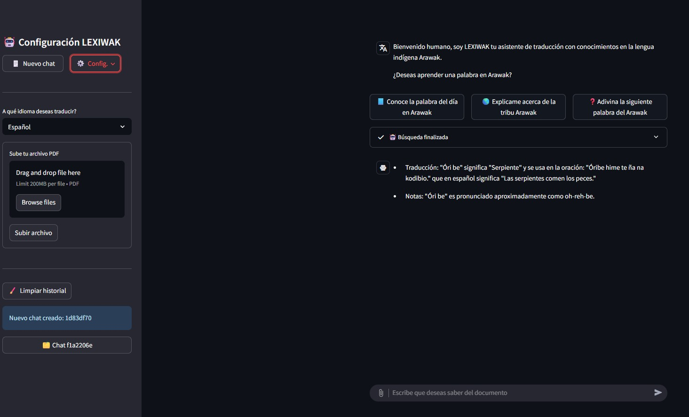

# :earth_americas: _LEXIWAK-BOT_

Este repositorio documenta el seguimiento en el desarrollo progresivo de LEXIWAK-BOT, un chatbot multilingüe diseñado para la preservación y revitalización de la lengua indígena Arawak, integrando traducción entre idiomas modernos (Español, Inglés, Alemán, Francés, Italiano) y el idioma ancestral Arawak.

Se presentan dos versiones principales:

- Versión 1: Punto de partida con funcionalidades básicas.
- Versión 2: Mejoras avanzadas que incluyen el uso de VectorDB, Recuperación Augmentada por Memoria (RAG), persistencia de memoria conversacional, embeddings semánticos y una interfaz de usuario más robusta e interactiva. Logrando destacar el compromiso en el desarrollo de un chatbot más avanzado y estructurado para preservar la lengua indígena Arawak.

Esta evolución refleja el compromiso en python y streamlit con la creación de un chatbot más estructurado, eficiente y culturalmente relevante.

### :dart: Características
- Traducción entre Arawak y otros idiomas modernos.
- Uso de LLMs para generación de texto con enfoque cultural.
- Diseño modular para fácil manejo de las herramientas.
- Uso de streamlit como interfaz avanzada con caracteristicas esenciales para brindar servicios de chatbot de alta calidad.
- Uso de memoria conversacional para contexto continuo.
- Preservación y revitalización lingüística.
  
### :rocket: Tecnologías usadas
- Python
- uv
- Ollama
- Streamlit
- LangChain

### :framed_picture: Visualización de la aplicación

| Vista Web | Vista Móvil |
|-----------|-------------|
|  |  |

| Vista Streamlit |
|------------------|
|  |


## :hammer_and_wrench: Configuración

### 1. Descargar Ollama y uv
- Ollama - [Download](https://ollama.com/)
- uv - [Terminal](https://docs.astral.sh/uv/#__tabbed_1_1)
> [!IMPORTANT]
> Para correr satisfactoriamente la aplicación y configuración debes contar con UV Python y Ollama (LLMs Open Source).

### 2. Instalar modelo de Ollama:
```bash
# Validar Ollama descargado
ollama

# Descargar modelos qwen
ollama run qwen3:latest
```

### 3. Clona el repositorio e instalar dependencias
```bash
git clone https://github.com/DonLuisM/languagesTranslate_Ollama.git
cd languagesTranslate_Ollama

uv add
uv sync
```

### 4. Ejecutar la aplicación
```bash
uv run streamlit run .\streamlit_V2\src\chatbot_st_V2.py
```
---

### :scroll: Licencia
Licencia MIT – consulta el archivo [LICENSE](../LICENSE) para más detalles.
